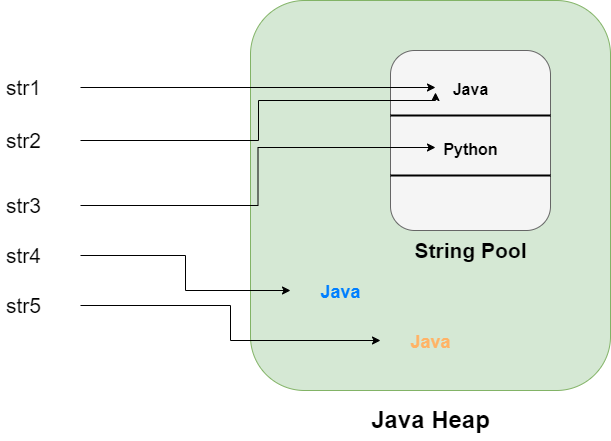

자바에서는 new를 사용해 초기화 하는 것을 참조 자료형, 그렇지 않고 바로 초기화가 가능한 것을 기본 자료형이라고 한다. 
참조 자료형 중에서 딱 하나 초기화할 때 예외적인 것은, 바로 문자열을 다루는 **String** 이다. 

```java
String str1 = "Java";

String str2 = new String("Java");
```

String은 참조 자료형이지만 new를 사용해서 객체를 생성하지 않아도 되는 유일한 타입이다.
그렇다면 위 코드와 같이 ""를 사용하는 경우와 new를 사용하는 경우는 어떤 차이가 있을까?

***

## String 객체 생성 방식
```java
String str1 = "Java";
String str2 = "Java"
String str3 = "Python";

String str4 = new String("Java");
String str5 = new String("Java");
```


###1. " "를 사용한 방식 (리터럴 방식)
    - literal로 생성한 String 값은 Heap 영역 내 "String Constant Pool"에 저장된다.
      - 위 코드에서, str1 객체의 "Java"라는 값은 String Pool에 저장된다.
      - str2 객체의 값인 "Java"가 이미 String Pool에 존재하므로 같은 곳을 참조하게 된다.
    - 따라서 str1 == str2 의 결과는 참이다. 

###2. new 연산자를 사용한 방식
   - new 연산자로 생성한 String 객체는 Heap 영역 내 각각에 존재한다. 
     - 위 코드에서, str4는 String Pool에 "Java"라는 값이 있어도, Heap 영역 내 별도의 객체를 참조하게 된다.
   - 따라서 str4 == str5의 결과는 거짓이다.


### intern 메서드 
- intern() 메서드는 해당 String과 같이 값은 String 객체가 String Pool에 존재하는지를 체크해준다. 
- 만약 String Pool에 존재한다면 그 객체의 reference를 그대로 return하고, 그렇지 않다면 String Pool에 새로 추가한 뒤 객체의 reference를 return한다.

***

### 메모리 관점
- new 연산자를 사용하여 String 객체를 사용할 경우, 매번 Heap 영역 내 새로운 객체를 생성하게 된다.
- 리터럴 방식을 사용하게 되면 String Pool에 있는 값을 재사용 할 수 있으므로, new 연산자를 사용한 방식보다 메모리 관점에서 좀 더 효율적이다.

- 추가적으로, String Pool 의 위치가 Heap 영역에 있기 때문에 String 객체들은 Garbage Collection의 대상이 된다.
