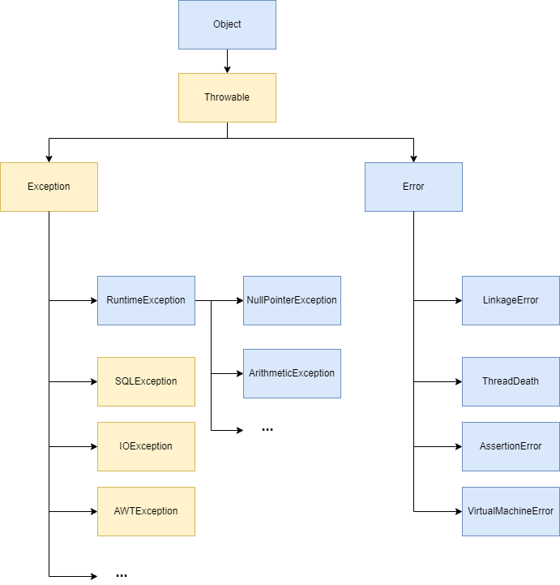

## 1. 예외의 종류


### 예외(Excpetion) 
  - 사용자의 잘못된 조작 또는 개발자의 잘못된 코딩으로 인해 발생하는 프로그램 오류 
  - 미리 예측하여 예외처리를 할 수 있다.
  - 예외가 발생되면 프로그램은 곧바로 종료되지만, 예외처리를 통해 정상 실행 상태가 유지될 수 있도록 할 수 있다.
  - 자바에서는 예외를 Class로 관리하여, 프로그램 실행 도중 예외 발생하면 해당 예외 클래스로 객체를 생성하고, 예외 처리 시 이 객체를 이용할 수 있도록 해준다.
  - 예외의 종류
    - Runtime Exception : 컴파일 과정에서 예외코드를 검사하지 않는 예외
      - Unchecked Exception : RuntimeExcpetion을 상속받는 모든 Exception 
      - 컴파일 이후 런타임 도중 예외를 확일할 수 있다.
      - 예외 발생 시 롤백(rollback) 진행 
      
    - Exception : 컴파일 체크 예외 
      - Checked Exception : Exception을 상속받는 하위 클래스 중 RuntimeExcpetion을 제외한 모든 Exception
      - 자바 소스를 컴파일하는 시점에서 예외를 확인할 수 있다.
      - 예외 처리 코드가 없다면 컴파일 오류 발생

    - 대표적인 예외들 
      - NullPointerExcpetion : Null 값을 가지고 있는 참조 변수로 접근 했을 때 발생
      - ArithmeticException : 어떤 수를 0으로 나눌 때 발생
      - ArrayIndexOutOfBoundsException : 배열에서 할당된 배열의 인덱스 범위를 초과해서 사용하는 경우
      - NumberFormatException : 문자열 데이터를 숫자로 변경할 때, 숫자로 변환될 수 없는 문자를 매개변수로 사용하는 경우
      - ClassCastException : 클래스 형변환을 적절치 못하게 하는 경우
      - OutOfMemoryException : 사용 가능한 메모리가 없는 경우
      - NoClassDefFoundException : 원하는 클래스를 찾지 못했을 경우

### 에러 (Error) 
- 컴퓨터 하드웨어의 동작의 오작동 또는 고장으로 인해 응용프로그램 실행 오류가 발생하는 것
- 시스템 레벨에서 발생하는 비정상적인 행위이기 때문에 이를 미리 예측하거나 처리할 수 없다. 


## 2. 예외처리 방법

### 직접 처리 방식 (예외를 잡아서 그 자리에서 처리)
#### try-catch-finally 구문
- 작성된 코드가 있는 메소드 안에서 직접적으로 예외처리

```java
try {
    // 예외가 발생할 가능성이 있는 코드를 예외 처리로 감싼다.
    String str = null;
    System.out.println(str.toString());
} catch (NullPointerError e) {
    System.out.println("NullPointerError 발생! : " + e.getMessage());  
} catch (Exception e) {
    // 수정 가능한 모든 에러 처리
    System.out.println(e.getMessage());
} finally {
    // Exception 발생 유무에 상관 없이 무조건 동작
    System.out.println("무조건 실행");
}
```
- try 블럭 내에서 예외가 발생한 경우 
  - 발생한 예외와 일치하는 catch 블럭이 있다면 블럭 내의 코드를 수행한 후, try-catch문을 빠져나가서 계속 실행
  - 그렇지 않다면 예외는 처리되지 못하고 종료

- 모든 예외는 Excpetion 클래스의 자손이기에 catch 블럭에 Exception을 선언하면 어떠한 에러든 해당 블럭에서 처리됨

- finally는 무조건 실행된다. (catch 구문에서 또 에러가 발생하더라도 실행된다.)

- try-catch-finally 구문의 단점
```java
BufferedReader br = new BufferedReader(new FileReader(path));
try {
    return br.readLine();
} finally {
    br.close();
}
```
- 가독성이 떨어지고, 자원이 늘어날 수록 더욱 지저분해진다.
- 또한 try 블록과 finally 블록에서 모두 예외가 발생할 경우, 두번째 예외가 첫번째 예외를 집어삼킨다.
  - 즉, 스택 추적 내역에 첫번째 예외에 관한 정보가 남지 않게 된다.

#### try-with-resources
- try에서 선언된 객체들에 대해, try가 종료될 때 자동으로 자원을 해제해주는 구문

```java
// try 안에 Exception 처리가 필요한 객체 선언
try (BufferedReader br = new BufferedReader(new FileReader(Path))) {
    return br.readLine();
} catch (IOExcpetion e){
    e.printStackTrace();
}
```
- 위 코드에서 try () 내에서 생성된 객체는 close() 를 명시하지 않아도 try 블럭을 벗어나는 순간 자동으로 close()를 호출
- try-catch-finally 의 문제점을 해결해주고, 자원이 늘어나더라도 가독성도 좋다. 

### 메서드가 예외를 발생시킨다고 기술하는 방법
#### throws 간접 처리 방식
- 자신이 처리하지 않고 throws를 통해 다른 메서드에게 예외처리를 넘겨주는 방식 
- 예외가 발생할 수 있는 메서드 뒤에 throws + 예외 종류를 붙여주면 예외 발생 시 자신을 호출한 상위 메서드로 예외를 넘겨준다.
- 만약 호출 스택을 계속해서 탐색하며 예외 처리를 구현한 메서드를 찾지 못하면, 런타임 시스템이 프로그램을 종료시킨다. 
```java
public void example() {
    ex1();  
}

public void ex1(){
    try{
        ex2();
    }catch(Excpetion e){
        e.printStackTrace();
    }
}

public void ex2() throws Exception{
    throw new Exception();
}
```
- 위 코드에서 ex2 함수에서 예외가 발생되었고, ex2를 호출한 ex1에서 해당 예외를 처리할 것이다.


#### throw 예외 생성
- throw 키워드를 사용해 예외를 생성하여, 강제로 예외처리를 발생하는 방식
```java
public void example() throws Exception {
    throw new Excpetion();    
}
```

-----------------------

- catch에서 또 에러 발생하면 finally 실행될지
